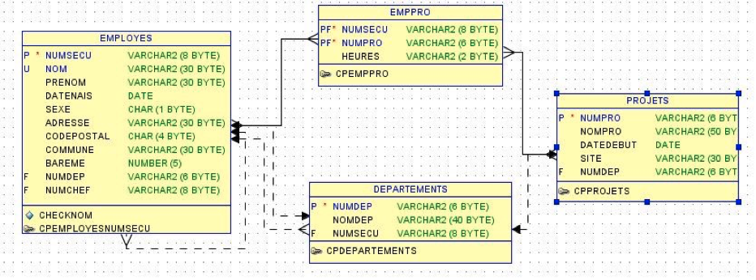

# Algèbre relationnelle

> Les exercices de ce chapitre seront réalisés à partir du schéma INFOSOFT



Table Départements

| NUMDEP |          NOMDEP           | NUMSECU |
| :----- | :-----------------------: | :------ |
| d00001 | Applications bureautiques | 935132  |
| d00002 |  Applications Main Frame  | 123456  |
| d00003 |   Applications telecom    | 864231  |
| d00004 |       Didacticiels        | 121212  |
| d00005 |     Images Numeriques     | 999999  |

Table Employés

| NUMSECU | NOM       | PRENOM          | DATENAIS   | SEXE | ADRESSE               | CODEPOSTAL | COMMUNE       | BAREME | NUMDEP | NUMCHEF |
| :------ | :-------- | :-------------- | :--------- | :--- | :-------------------- | :--------- | :------------ | :----- | :----- | :------ |
| 123456  | CURTIS    | Tony            | 1960-02-17 | M    | rue Egalite, 18       | 4430       | ANS           | 70000  | d00002 | 192357  |
| 451278  | CELARIE   | Clementine      | 1990-10-10 | F    | rue Tige, 7           | 4040       | HERSTAL       | 80000  | d00001 | 935132  |
| 654321  | BEART     | Emmanuelle      | 1995-04-04 | F    | quai Boverie, 102     | 4000       | LIEGE         | 90000  | d00002 | 123456  |
| 123457  | HOFFMAN   | Dustin          | 1979-03-19 | M    | rue Lantin, 163       | 4430       | ANS           | 60000  | d00004 | 121212  |
| 789999  | CLAVIER   | Christian       | 1987-11-10 | M    | La Batte, 9           | 4000       | LIEGE         | 65000  | d00002 | 654321  |
| 864231  | LAFONT    | Bernadette      | 1975-01-14 | F    | rue Vaudr?e, 162      | 4000       | LIEGE         | 90000  | d00003 | 192357  |
| 439549  | DE NIRO   | Robert          | 1980-11-02 | M    | rue Bonne Foi, 5      | 4040       | HERSTAL       | 88000  | d00002 | 123456  |
| 121212  | STALLONE  | Sylvester       | 1982-01-20 | M    | chaussee Romaine, 174 | 4300       | WAREMME       | 95000  | d00004 | 192357  |
| 334410  | BERTHIER  | Marie-Sophie L. | 1990-02-02 | F    | allee Dubois, 5       | 4050       | CHAUDFONTAINE | 67000  | d00003 | 864231  |
| 935132  | REDFORD   | Robert          | 1970-02-15 | M    | avenue Alouettes, 9   | 4120       | NEUPRE        | 99000  | d00001 | 192357  |
| 935133  | MOORE     | Demi            | 2000-12-15 | F    | rue Noisetiers, 9     | 4120       | NEUPRE        | 54000  | d00004 | 123457  |
| 192356  | BOHRINGER | Romane          | 2000-01-01 | F    | rue Bolland, 38       | 4260       | BRAIVES       | 66000  | d00003 | 864231  |
| 192357  | LHERMITTE | Thierry         | 1985-12-12 | M    | rue Vieux Pre, 6      | 4050       | CHAUDFONTAINE | 56700  | NULL   | NULL    |
| 999999  | MONROE    | Marilyn         | NULL       | NULL | NULL                  | NULL       | NULL          | NULL   | NULL   | NULL    |

Table Projets

| NUMPRO | NOMPRO                 | DATEDEBUT  | SITE    | NUMDEP |
| :----- | :--------------------- | :--------- | :------ | :----- |
| p10345 | Intranet               | 2020-01-05 | SERAING | d00003 |
| p10346 | Gihep                  | 2020-09-12 | LIEGE   | d00004 |
| p10347 | Eole                   | 2020-02-01 | LONDON  | d00004 |
| p10348 | E-commerce             | 2020-01-15 | SERAING | d00001 |
| p10349 | Web                    | 2020-06-13 | LIEGE   | d00002 |
| p10350 | Gps - Cartographie     | 2020-05-19 | LIEGE   | d00002 |
| p10351 | Email                  | 2020-02-13 | LIEGE   | d00001 |
| p10352 | Jeux - Divertissements | 2020-03-19 | LIEGE   | d00002 |

Table EmpPro

| NUMSECU | NUMPRO | HEURES |
| :------ | :----- | :----- |
| 451278  | p10345 | 10     |
| 451278  | p10346 | 12     |
| 451278  | p10349 | 10     |
| 451278  | p10351 | 8      |
| 935132  | p10348 | 18     |
| 935132  | p10351 | 18     |
| 123456  | p10345 | 15     |
| 123456  | p10349 | 10     |
| 123456  | p10350 | 15     |
| 654321  | p10349 | 15     |
| 654321  | p10350 | 10     |
| 789999  | p10350 | 15     |
| 789999  | p10352 | 15     |
| 439549  | p10349 | 40     |
| 864231  | p10345 | 20     |
| 864231  | p10348 | 10     |
| 864231  | p10349 | 10     |
| 334410  | p10352 | 30     |
| 192356  | p10347 | 10     |
| 192356  | p10349 | 8      |
| 123457  | p10346 | 10     |
| 123457  | p10347 | 15     |
| 123457  | p10350 | 15     |
| 121212  | p10346 | 19     |
| 121212  | p10347 | 19     |

## Algèbre relationnelle 1

Donner les  tuples de la relation X

$$
X = PROJECTION(Departements, NumSecu)
    \cup
   PROJECTION(Employes, NumChef)
$$

> 

Complétez le tableau ci-dessous avec le nom des opérateurs utilisés dans la question précédente

| Opérateur ensembliste | Opérateur relationnel | Opérateurs additionnels |
| :-------------------: | :-------------------: | :---------------------: |
|                       |                       |                         |

Représentez les ensembles

>

Quelle est la question à poser pour obtenir ce résultat ?

> 

Ecrivez  la requête SQL pour obtenir ce résultat

```sql

```

## Algèbre relationnelle 2

Donnez les tuples de la relation X

$$
X = PROJECTION(Departements,NumSecu)   -
      PROJECTION(Employes,NumChef)
$$

> 

Complétez le tableau ci-dessous avec le nom des opérateurs utilisés dans la question précédente

| Opérateur ensembliste | Opérateur relationnel | Opérateurs additionnels |
| :-------------------: | :-------------------: | :---------------------: |
|                       |                       |                         |

Représentez les ensembles


Quelle est la question à poser pour obtenir ce résultat ?

> 

Ecrivez  la requête SQL pour obtenir ce résultat

```sql

```

## Algèbre relationnelle 3

Donnez les tuples de la relation Y

$$
X = PROJECTION(Departements,NumDep)  
  \times
    PROJECTION(  SELECTION(Employes /  NumSecu > 900000),  Nom)
$$

> 

Complétez le tableau ci-dessous avec le nom des opérateurs utilisés dans la question précédente

| Opérateur ensembliste | Opérateur relationnel | Opérateurs additionnels |
| :-------------------: | :-------------------: | :---------------------: |
|                       |                       |                         |

Quelle est la question à poser pour obtenir ce résultat ?

> 

Ecrivez  la requête SQL pour obtenir ce résultat

```sql

```

## Algèbre relationnelle 4

Donnez les tuples de la relation Y
$$
X = PROJECTION(Employes.NumChef)
   ∩
    PROJECTION(Departements.NumSecu)
$$

> 

Complétez le tableau ci-dessous avec le nom des opérateurs utilisés dans la question précédente

| Opérateur ensembliste | Opérateur relationnel | Opérateurs additionnels |
| :-------------------: | :-------------------: | :---------------------: |
|                       |                       |                         |

Représentez les ensembles


Quelle est la question à poser pour obtenir ce résultat ?

> 

Ecrivez  deux requêtes SQL pour obtenir ce résultat

Une requête utilisera un opérateur additionnel tandis que l'autre un opérateur ensembliste.

Opérateur additionnel : intersection

```sql

```

Opérateur ensembliste : MINUS  

```sql

```

## Algèbre relationnelle 5

Donnez les  tuples de la relation X

$$
X =  PROJECTION(SELECTION (
       JOINTURE(Departements,Employes /
                Departements.NumDep = Employes.NumDep ) /
       Nom = 'DE NIRO'),
     NomDep)
$$

> 

Complétez le tableau ci-dessous avec le nom des opérateurs utilisés dans la question précédente

| Opérateur ensembliste | Opérateur relationnel | Opérateurs additionnels |
| :-------------------: | :-------------------: | :---------------------: |
|                       |                       |                         |

Quelle est la question à poser pour obtenir ce résultat ?

> 

Ecrivez  la requête SQL pour obtenir ce résultat

```sql

```

## Algèbre relationnelle 6

Donnez les tuples de la relation X

$$
X =  PROJECTION( SELECTION(
        JOINT\_EXT LEFT(Employes,EmpPro /
                         Employes.NumSecu = EmpPro.NumSecu)   /
        EmpPro.NumSecu est Inconnu ),
     NumSecu)
$$

> 

Complétez le tableau ci-dessous avec le nom des opérateurs utilisés dans la question précédente

| Opérateur ensembliste | Opérateur relationnel | Opérateurs additionnels |
| :-------------------: | :-------------------: | :---------------------: |
|                       |                       |                         |

Quelle est la question à poser pour obtenir ce résultat ?

> 

Ecrivez  la requête SQL pour obtenir ce résultat

```sql

```

## Algèbre relationnelle 7

$$
X =  PROJECTION(
        JOINT\_EXT RIGHT (Employes,EmpPro /
                      Employes.numsecu = Empro.numsecu),
$$

> 

Complétez le tableau ci-dessous avec le nom des opérateurs utilisés dans la question précédente

| Opérateur ensembliste | Opérateur relationnel | Opérateurs additionnels |
| :-------------------: | :-------------------: | :---------------------: |
|                       |                       |                         |

Quelle est la question à poser pour obtenir ce résultat ?

> 

Ecrivez  la requête SQL pour obtenir ce résultat

```sql

```

Quelle est l'utilité d'utiliser un RIGHT JOIN dans ce cas-ci ?

> 

Donnez la requête équivalente sans jointure externe :

```sql

```


Demander un exemple de requête avec ces mêmes tables dans laquelle le RIGHT JOIN aurait été nécessaire 

> 


## Exercices sur l'intégrité

Exercices sur les contraintes structurelles du modèle relationnel

### Integrite 1

```sql

```

>  


### Integrite 2

Exécuter une requête d’insertion  pour violer l’intégrité référentielle.

```sql

```

> 

### Integrite 3

Exécuter une requête de suppression pour violer l’intégrité référentielle.

```sql

```

> 

### Integrite 4

Exécuter une requête d’insertion  pour insérer une valeur référençante inconnue (NULL).

```sql

```

> Integrite 5

Exécuter la procédure `AjouterProjet` du package `GestionProjets`  pour violer une intégrité de domaine

```sql

```

> 

